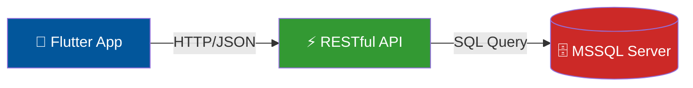
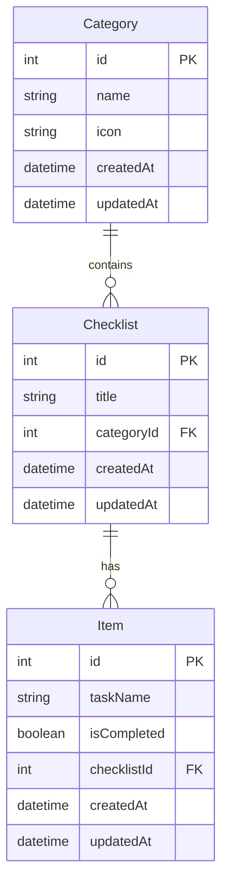

<div align="center">

# 🚀 SyncList

**Modern Checklist & Task Management Application**

[](https://flutter.dev/)
[](https://nodejs.org/)
[](https://expressjs.com/)
[](https://www.microsoft.com/sql-server)
[](https://sequelize.org/)

---

*Kullanıcıların günlük işlerini, alışveriş listelerini ve seyahat planlarını organize etmelerini sağlayan modern bir mobil uygulamadır.*

[📖 Kurulum](#-kurulum-setup) • [🎯 Özellikler](#-temel-özellikler) • [🏗️ Mimari](#%EF%B8%8F-teknik-mimari) • [📸 Ekran Görüntüleri](#-ekran-görüntüleri)

</div>

---

## ✨ Temel Özellikler

| Özellik | Açıklama |
|---------|----------|
| 📋 **Dinamik Liste Yönetimi** | İhtiyaca göre özelleştirilebilir kontrol listeleri oluşturma |
| 🏷️ **Kategorizasyon** | Listeleri (Seyahat, Market, İş vb.) kategorilere ayırarak düzenleme |
| 📊 **Gerçek Zamanlı İlerleme** | Tamamlanan maddelere göre otomatik güncellenen ilerleme yüzdesi |
| 🔍 **Gelişmiş Filtreleme** | Tamamlanmış ve tamamlanmamış öğeleri anlık olarak filtreleme |
| ✏️ **CRUD Operasyonları** | Liste ve madde bazında ekleme, silme ve düzenleme yeteneği |
| 🔒 **Merkezi Veritabanı** | Tüm verilerin MSSQL üzerinde güvenli bir şekilde saklanması |

---

## 🏗️ Teknik Mimari

Proje, üç ana katmandan oluşmaktadır:



### Katmanlar

| Katman | Teknoloji | Açıklama |
|--------|-----------|----------|
| **Frontend** | Flutter & Dart | Cross-platform mobil uygulama |
| **Backend** | Node.js & Express.js | RESTful API & iş mantığı |
| **Database** | Microsoft SQL Server | İlişkisel veritabanı |
| **ORM** | Sequelize | Veritabanı yönetimi & migration |

---

## 🗃️ Veritabanı Şeması



### Tablo Açıklamaları

| Tablo | Açıklama |
|-------|----------|
| **Categories** | Liste türlerini gruplar (Seyahat, Market, İş vb.) |
| **Checklists** | Ana liste başlıklarını ve ilerleme durumlarını tutar |
| **Items** | Listelerin içindeki her bir görevi ve tamamlanma durumunu tutar |

---

## � Proje Yapısı

```
SyncList-/
├── 📂 backend/                 # Node.js API
│   ├── 📂 config/             # Veritabanı konfigürasyonu
│   ├── 📂 migrations/         # Sequelize migration dosyaları
│   ├── 📂 models/             # Sequelize model tanımları
│   ├── 📂 seeders/            # Örnek veri dosyaları
│   ├── 📄 index.js            # Ana sunucu dosyası
│   ├── 📄 package.json        # Node.js bağımlılıkları
│   └── 📄 .env                # Ortam değişkenleri
│
├── 📂 frontend/               # Flutter mobil uygulama
│   ├── 📂 lib/                # Dart kaynak kodları
│   ├── 📂 android/            # Android platform dosyaları
│   ├── 📂 ios/                # iOS platform dosyaları
│   ├── 📂 web/                # Web platform dosyaları
│   ├── 📂 windows/            # Windows platform dosyaları
│   ├── 📂 linux/              # Linux platform dosyaları
│   ├── 📂 macos/              # macOS platform dosyaları
│   └── 📄 pubspec.yaml        # Flutter bağımlılıkları
│
└── 📄 README.md               # Proje dokümantasyonu
```

---

## ⚙️ Gereksinimler

Projeyi çalıştırmadan önce aşağıdaki yazılımların sisteminizde kurulu olduğundan emin olun:

| Yazılım | Minimum Versiyon | İndirme Linki |
|---------|-----------------|---------------|
| **Node.js** | v18.0.0+ | [nodejs.org](https://nodejs.org/) |
| **npm** | v9.0.0+ | Node.js ile birlikte gelir |
| **Flutter SDK** | v3.10.0+ | [flutter.dev](https://flutter.dev/docs/get-started/install) |
| **Dart SDK** | v3.0.0+ | Flutter SDK ile birlikte gelir |
| **MSSQL Server** | 2019+ | [microsoft.com](https://www.microsoft.com/sql-server) |
| **Git** | v2.0.0+ | [git-scm.com](https://git-scm.com/) |

---

## 🚀 Kurulum (Setup)

### 📋 Ön Hazırlık

```bash
# Projeyi klonlayın
git clone https://github.com/your-username/SyncList-.git

# Proje dizinine gidin
cd SyncList-
```

---

### 1️⃣ Veritabanı Kurulumu

#### Adım 1.1: MSSQL Server Bağlantısı

SQL Server Management Studio (SSMS) veya Azure Data Studio ile SQL Server'a bağlanın.

#### Adım 1.2: Veritabanı Oluşturma

```sql
-- Yeni veritabanı oluşturun
CREATE DATABASE SyncListDB;
GO

-- Veritabanını kullanın
USE SyncListDB;
GO
```

#### Adım 1.3: Kullanıcı Yapılandırması (Opsiyonel)

```sql
-- Uygulama için özel bir kullanıcı oluşturun
CREATE LOGIN synclist_user WITH PASSWORD = 'GüçlüŞifre123!';
CREATE USER synclist_user FOR LOGIN synclist_user;
ALTER ROLE db_owner ADD MEMBER synclist_user;
GO
```

---

### 2️⃣ Backend API Kurulumu

#### Adım 2.1: Backend Dizinine Gidin

```bash
cd backend
```

#### Adım 2.2: Bağımlılıkları Yükleyin

```bash
npm install
```

#### Adım 2.3: Ortam Değişkenlerini Yapılandırın

`.env` dosyasını düzenleyin:

```env
# Veritabanı Bağlantı Bilgileri
DB_HOST=localhost
DB_PORT=1433
DB_NAME=SyncListDB
DB_USER=sa
DB_PASSWORD=YourPassword123!

# Sunucu Ayarları
PORT=3000
NODE_ENV=development
```

#### Adım 2.4: Veritabanı Tablolarını Oluşturun (Migration)

```bash
# Migration'ları çalıştırın
npm run migrate
```

> 💡 **Not:** Bu komut `Categories`, `Checklists` ve `Items` tablolarını otomatik olarak oluşturacaktır.

#### Adım 2.5: Backend Sunucusunu Başlatın

```bash
# Geliştirme modunda başlatın (nodemon ile)
npm start
```

✅ **Başarılı Çıktı:**
```
🚀 Server is running on port 3000
📦 Database connected successfully
```

#### Adım 2.6: API'yi Test Edin

Tarayıcınızda veya Postman'de aşağıdaki endpoint'i test edin:

```
GET http://localhost:3000/api/health
```

---

### 3️⃣ Flutter Uygulaması Kurulumu

#### Adım 3.1: Frontend Dizinine Gidin

```bash
cd ../frontend
```

#### Adım 3.2: Flutter Bağımlılıklarını Yükleyin

```bash
flutter pub get
```

#### Adım 3.3: API URL'sini Yapılandırın

`lib/` klasöründeki API konfigürasyon dosyasında backend URL'sini güncelleyin:

```dart
// lib/config/api_config.dart
const String baseUrl = 'http://localhost:3000/api';

// Android Emulator için:
// const String baseUrl = 'http://10.0.2.2:3000/api';

// Fiziksel cihaz için (aynı ağda):
// const String baseUrl = 'http://192.168.x.x:3000/api';
```

#### Adım 3.4: Flutter Ortamını Kontrol Edin

```bash
flutter doctor
```

✅ Tüm kontrollerin geçtiğinden emin olun.

#### Adım 3.5: Uygulamayı Çalıştırın

##### 📱 Android Emulator:
```bash
flutter run
```

##### 🍎 iOS Simulator (macOS gerekli):
```bash
flutter run -d ios
```

##### 🌐 Web Tarayıcı:
```bash
flutter run -d chrome
```

##### 🖥️ Desktop (Windows/Linux/macOS):
```bash
# Windows
flutter run -d windows

# Linux
flutter run -d linux

# macOS
flutter run -d macos
```

---

## 🧪 Geliştirme Komutları

### Backend Komutları

```bash
# Sunucuyu başlat
npm start

# Migration'ları çalıştır
npm run migrate

# Migration'ları geri al
npm run migrate:undo
```

### Flutter Komutları

```bash
# Bağımlılıkları güncelle
flutter pub upgrade

# Uygulamayı release modunda derle
flutter build apk --release          # Android
flutter build ios --release          # iOS
flutter build web --release          # Web

# Testleri çalıştır
flutter test
```

---

## 🔌 API Endpoints

| Method | Endpoint | Açıklama |
|--------|----------|----------|
| `GET` | `/api/categories` | Tüm kategorileri listele |
| `POST` | `/api/categories` | Yeni kategori oluştur |
| `GET` | `/api/checklists` | Tüm listeleri getir |
| `POST` | `/api/checklists` | Yeni liste oluştur |
| `PUT` | `/api/checklists/:id` | Liste güncelle |
| `DELETE` | `/api/checklists/:id` | Liste sil |
| `GET` | `/api/items/:checklistId` | Liste öğelerini getir |
| `POST` | `/api/items` | Yeni öğe ekle |
| `PUT` | `/api/items/:id` | Öğe güncelle |
| `DELETE` | `/api/items/:id` | Öğe sil |

---

## 📸 Ekran Görüntüleri

> 📌 *Ekran görüntüleri yakında eklenecek...*

<!--
| Ana Sayfa | Liste Detay | Kategori Seçimi |
|-----------|-------------|-----------------|
|  |  |  |
-->

---

## 🛠️ Sorun Giderme

### Yaygın Hatalar ve Çözümleri

<details>
<summary><b>❌ MSSQL Bağlantı Hatası</b></summary>

```
Error: Failed to connect to localhost:1433
```

**Çözüm:**
1. SQL Server'ın çalıştığından emin olun
2. TCP/IP protokolünün etkin olduğunu kontrol edin
3. Firewall ayarlarını kontrol edin
4. `.env` dosyasındaki bağlantı bilgilerini doğrulayın

</details>

<details>
<summary><b>❌ Migration Hatası</b></summary>

```
SequelizeConnectionError: Login failed
```

**Çözüm:**
1. Veritabanının oluşturulduğundan emin olun
2. Kullanıcı adı ve şifreyi kontrol edin
3. SQL Server Authentication modunun etkin olduğunu doğrulayın

</details>

<details>
<summary><b>❌ Flutter Build Hatası</b></summary>

**Çözüm:**
```bash
flutter clean
flutter pub get
flutter run
```

</details>

---

## 🤝 Katkıda Bulunma

Katkılarınızı bekliyoruz! Lütfen şu adımları izleyin:

1. Bu repository'yi fork edin
2. Feature branch oluşturun (`git checkout -b feature/AmazingFeature`)
3. Değişikliklerinizi commit edin (`git commit -m 'Add some AmazingFeature'`)
4. Branch'inizi push edin (`git push origin feature/AmazingFeature`)
5. Pull Request oluşturun

---

## 📄 Lisans

Bu proje [MIT Lisansı](LICENSE) altında lisanslanmıştır.

---

## 📧 İletişim

**Proje Sahibi:** Yasin

**Proje Linki:** [https://github.com/your-username/SyncList-](https://github.com/your-username/SyncList-)

---

<div align="center">

⭐ Bu projeyi beğendiyseniz yıldız vermeyi unutmayın! ⭐

</div>
# SyncList
